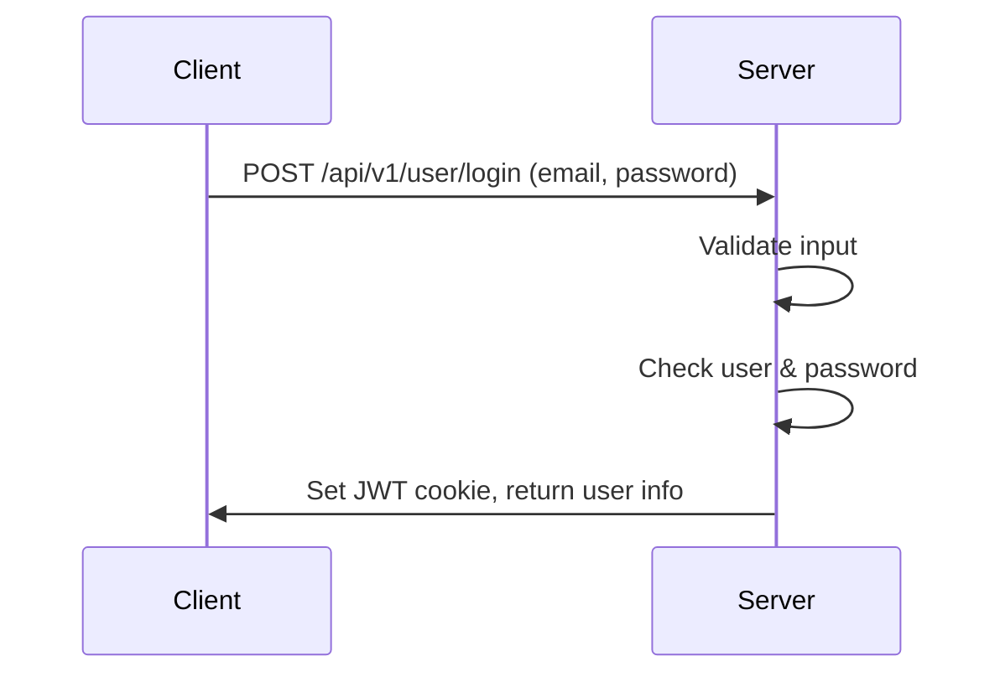

# Uber Clone – Ride Booking Platform

A backend system for an Uber-like ride booking platform, featuring secure user registration, login, and logout with JWT token management and token blacklisting using MongoDB.

---

## 🚀 Project Description

This project provides a secure and scalable backend for an Uber clone ride booking platform. It currently supports user authentication features including registration (with input validation and password hashing), login (JWT-based authentication with HTTP-only cookies), and logout (with JWT token blacklisting for security).

---

## 🛠️ Tech Stack

- **Node.js** & **Express.js** (Backend framework)
- **MongoDB** & **Mongoose** (Database & ODM)
- **bcrypt** (Password hashing)
- **jsonwebtoken** (JWT token handling)
- **cookie-parser** (Cookie management)
- **express-validator** (Input validation)
- **dotenv** (Environment variable management)
- **nodemon** (Development server)

---

## 🏗️ Folder Structure

```
server/
│
├── .env
├── .gitignore
├── app.js
├── package.json
├── server.js
└── src/
    ├── controllers/
    │   └── user.controller.js
    ├── database/
    │   └── db.js
    ├── middlewares/
    │   └── auth.middleware.js
    ├── models/
    │   ├── blacklist.models.js
    │   └── user.models.js
    └── routes/
        └── user.routes.js
```

---

## ⚙️ How to Run Locally

1. **Clone the repository:**
   ```bash
   git clone <your-repo-url>
   cd server
   ```

2. **Install dependencies:**
   ```bash
   npm install
   ```

3. **Create a `.env` file in the root with the following variables:**
   ```env
   MONGO_URL="your_mongodb_connection_string"
   PORT=3000
   JWT_SECRETE_KEY="your_jwt_secret_key"
   ```

4. **Start the development server:**
   ```bash
   npm start
   ```

5. **Server will run at:**  
   `http://localhost:3000` (or your specified port)

---

## 📚 API Routes

| Method | Route                    | Description                                 |
|--------|--------------------------|---------------------------------------------|
| POST   | `/api/v1/user/register`  | Register a new user (with validation)        |
| POST   | `/api/v1/user/login`     | Login user and receive JWT in cookie         |
| GET    | `/api/v1/user/logout`    | Logout user and blacklist JWT token          |

---

## 🔄 Visual Code Flow

### 1. Register API


### 2. Login API



### 3. Logout API


---

## 📦 Example Usage

### Register User

**Request:**
```http
POST /api/v1/user/register
Content-Type: application/json

{
  "fullname": { "firstname": "John", "lastname": "Doe" },
  "email": "john.doe@example.com",
  "password": "StrongPassword123"
}
```

**Response:**
```json
{
  "success": true,
  "user": {
    "_id": "60f1c2d5e1b1c2d5e1b1c2d5",
    "fullname": { "firstname": "John", "lastname": "Doe" },
    "email": "john.doe@example.com"
  },
  "message": "User created successfully !!!"
}
```

---

### Login User

**Request:**
```http
POST /api/v1/user/login
Content-Type: application/json

{
  "email": "john.doe@example.com",
  "password": "StrongPassword123"
}
```

**Response:**
```json
{
  "success": true,
  "user": {
    "_id": "60f1c2d5e1b1c2d5e1b1c2d5",
    "fullname": { "firstname": "John", "lastname": "Doe" },
    "email": "john.doe@example.com"
  },
  "message": "User login successfully !!!"
}
```
> **Note:** A JWT token will be set in an HTTP-only cookie.

---

### Logout User

**Request:**
```http
GET /api/v1/user/logout
Cookie: token=<your_jwt_token>
```

**Response:**
```json
{
  "success": true,
  "message": "Logout successfully !!"
}
```

---

## 🔮 Future Features

- 🚗 Book a Ride (user can book a ride)
- 📍 Driver & Rider Matching
- 💳 Payment Integration
- 🔒 Forgot Password (email-based reset)
- 📝 Profile Update (name, email, password)
- 🛡️ Role-based Authorization (driver, rider, admin)
- 📧 Email Verification
- 📊 User Activity Logs

---

## 🤝 Contribution

Contributions are welcome!  
Please open issues or submit pull requests for improvements and new features.

---
